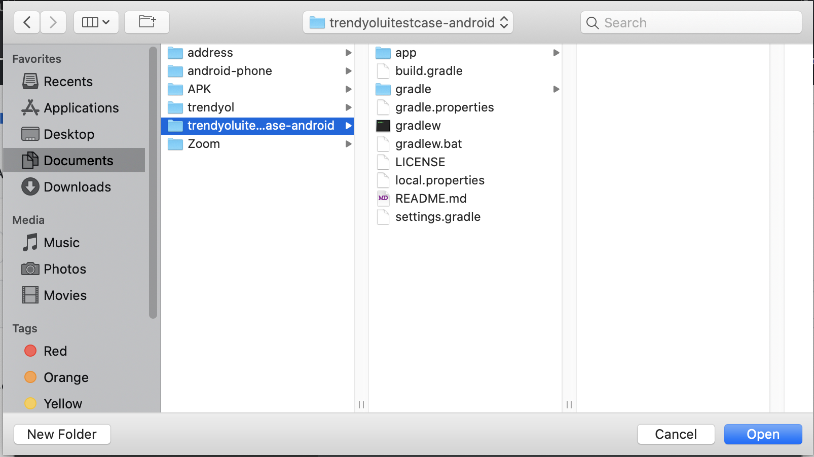

# Trendyol UI Automation Case for Android

A sample Android project for creating test cases and automate for these cases.

## Tutorial

### Open Project

```
To be able to open project, you may download to project as ZIP or clone the project with the given URL.
```


```
If you download the project as ZIP, open Android Studio and select "Open an existing Android Studio project" option. 
After you select project's folder, press open and wait until the gradle build is finished successfully. 
```




```
If you clone the project, open Android Studio and select "Get from Version Control" option. 
Enter the given URL for cloning the project into URL field, and press clone and wait until the gradle build is finished successfully. 
```


### How to Install Application

```
In order to install the application into your physical device or emulator, press run icon.
After the build is finished, the application should be successfully installed on your phone.
```


### How to extract APK 

```
In the Android Studio menu, go to Build > Build Bundle(s) / APK (s) and press Build APK(s) option.
Then, the 'locate' button should open File Explorer with the extracted APK. 
You may install the application manually with this APK. 
```


